# Tarea 3 — Virtualización: Configuración de Red en Ubuntu Server (VirtualBox)

Este documento evidencia la configuración de red de una máquina virtual `Ubuntu 26.04 LTS` sobre `Oracle VirtualBox`, con el adaptador de red en **modo Bridge (Adaptador puente)**, cubriendo tres escenarios: asignación por `DHCP`, IP estática dentro del rango correcto de la subred, e IP estática fuera de rango (caso de fallo). Cada escenario incluye la captura de la IP asignada y el resultado de `ping -c 4 google.com`.

## 1. Datos de la máquina virtual

| Parámetro | Valor |
|---|---|
| Hostname | `Raul` |
| Sistema operativo | `Ubuntu 26.04 LTS` |
| Kernel | `Linux 7.0.0-29-generic x86_64` |
| Hipervisor | `Oracle VirtualBox` (Firmware `VirtualBox 1.2`) |
| Modo de red | `Bridge (Adaptador puente)` |
| Interfaz de red | `enp0s3` |
| MAC address | `08:00:27:4b:1b:ba` |

**Arranque de la VM (GRUB) e inicio de sesión:**

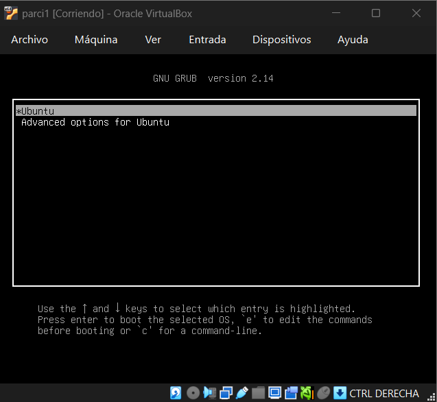
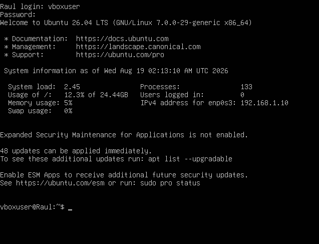

**Información del sistema (`hostnamectl`):**

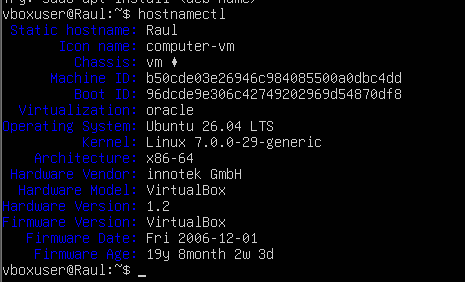

**Archivo `/etc/hosts`:**

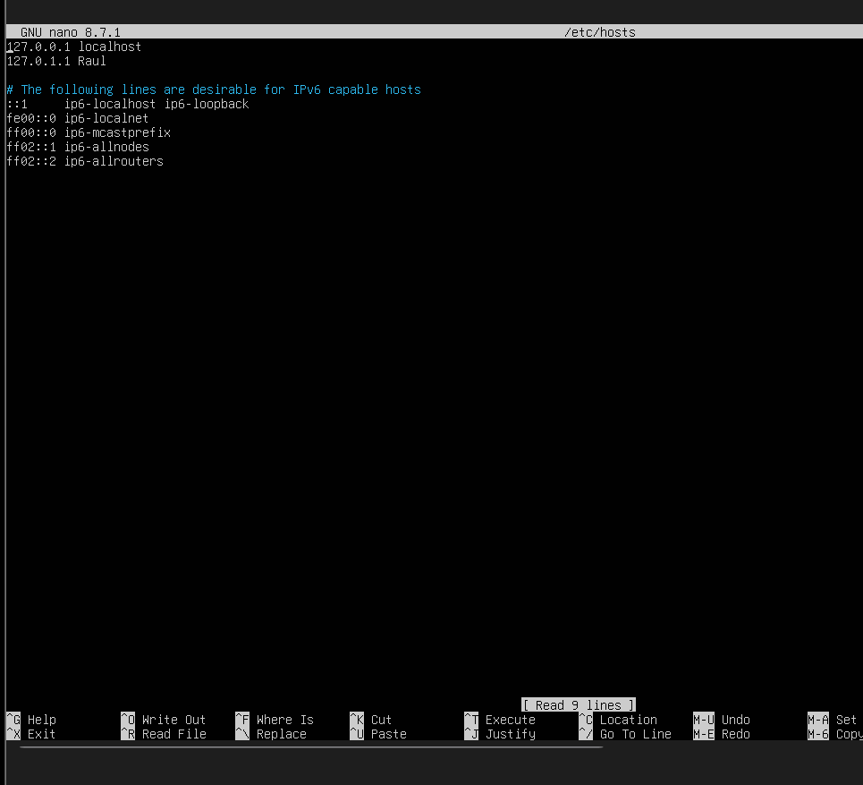

---

## 2. Configuración del adaptador en modo Bridge y subred de la red física

Al usar `Adaptador puente (Bridge)`, la VM se conecta directamente a la red física (LAN) del host, como un equipo más de esa red — por eso su IP pertenece a la misma subred que el resto de dispositivos conectados al router/switch físico (en este caso `192.168.1.0/24`), y no a una red interna generada por VirtualBox.

> ⚠️ **Pendiente:** agregar aquí la captura de `Configuración > Red > Adaptador 1` de VirtualBox mostrando `Conectado a: Adaptador puente` y la interfaz física seleccionada, para comprobar que el modo Bridge está activo y que la IP asignada corresponde a la subred de la red física.

| Elemento | Valor |
|---|---|
| Modo de conexión | `Adaptador puente (Bridged Adapter)` |
| Subred de la red física (LAN) | `192.168.1.0/24` |
| Puerta de enlace de la red física | `192.168.1.1` |

<!-- Cuando tenga la captura, guárdela como IMAGE/00-adaptador-bridge.png y descomente la línea siguiente: -->
<!--  -->

---

## 3. Escenarios de configuración

### Escenario 1 — Modo Bridge con IP por `DHCP`

Con el adaptador en modo `Bridge`, la VM sale a la red física y toma IP del servidor DHCP del router. Configuración en `/etc/netplan/00-installer-config.yaml` con `dhcp4: true`:

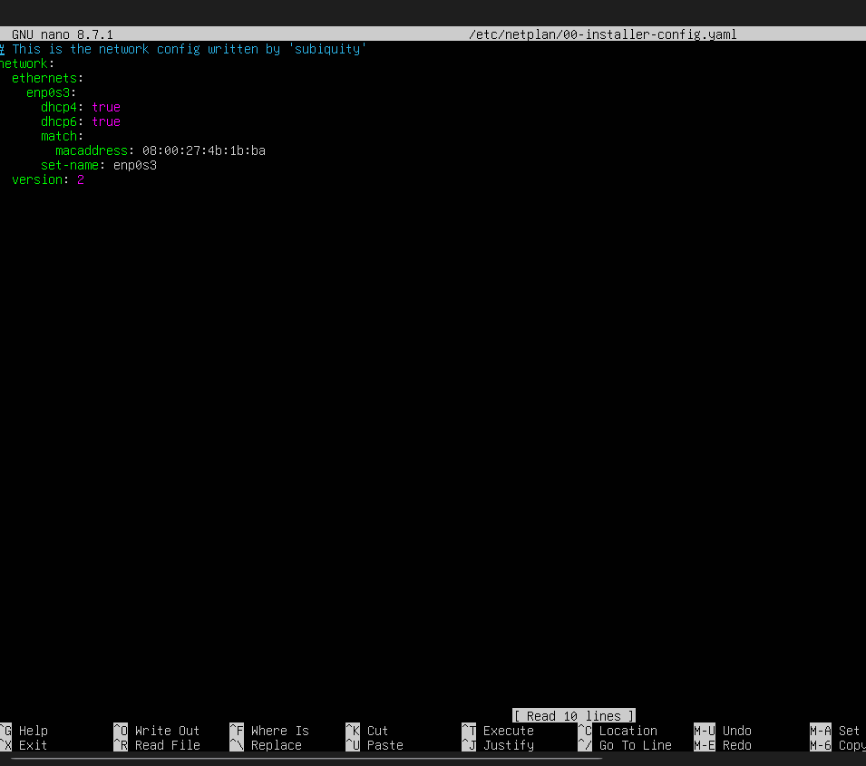

Al ejecutar `sudo netplan apply` y verificar con `ip a`, la interfaz `enp0s3` recibe la IP `192.168.1.13/24` por parte del servidor DHCP de la red física:

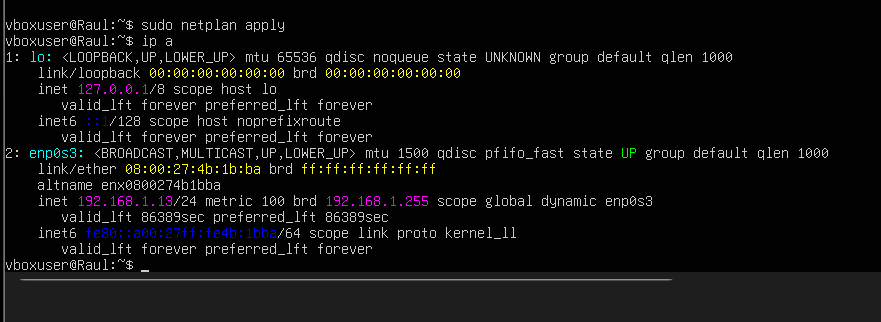

**Prueba de conectividad — `ping -c 4 google.com`:**

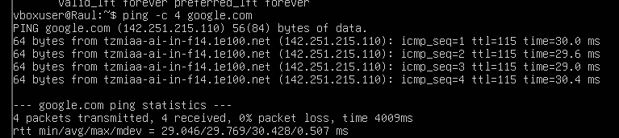

`Resultado: 4 paquetes transmitidos, 4 recibidos, 0% de pérdida` ✅

---

### Escenario 2 — Modo Bridge con IP estática dentro de la misma subred

Se edita `/etc/netplan/00-installer-config.yaml` con `dhcp4: false` y una dirección estática `192.168.1.50/24`, dentro del mismo rango de la red física (`192.168.1.0/24`), con puerta de enlace `192.168.1.1` y DNS `8.8.8.8` / `1.1.1.1`:

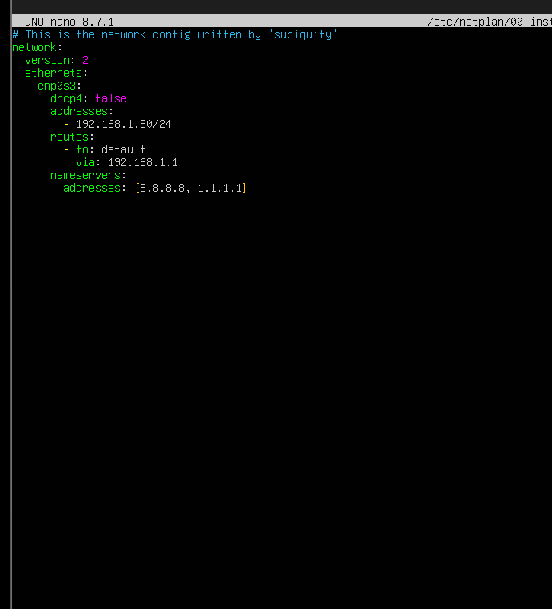

Tras `sudo netplan apply`, `ip a` confirma la IP estática asignada correctamente:

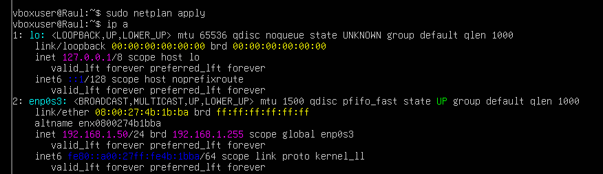

**Prueba de conectividad — `ping -c 4 google.com`:**

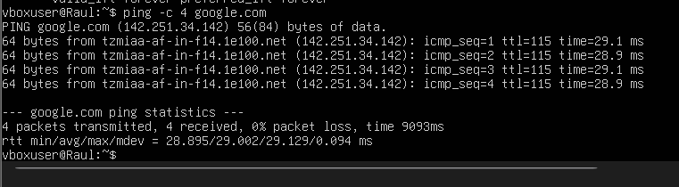

`Resultado: 4 paquetes transmitidos, 4 recibidos, 0% de pérdida` ✅

---

### Escenario 3 — Modo Bridge con IP estática fuera de la subred de la red física (caso de fallo)

Se modifica la configuración a una dirección `10.0.0.50/24`, con puerta de enlace `10.0.0.1`, la cual **no** pertenece a la subred `192.168.1.0/24` de la red física a la que está puenteado el adaptador:

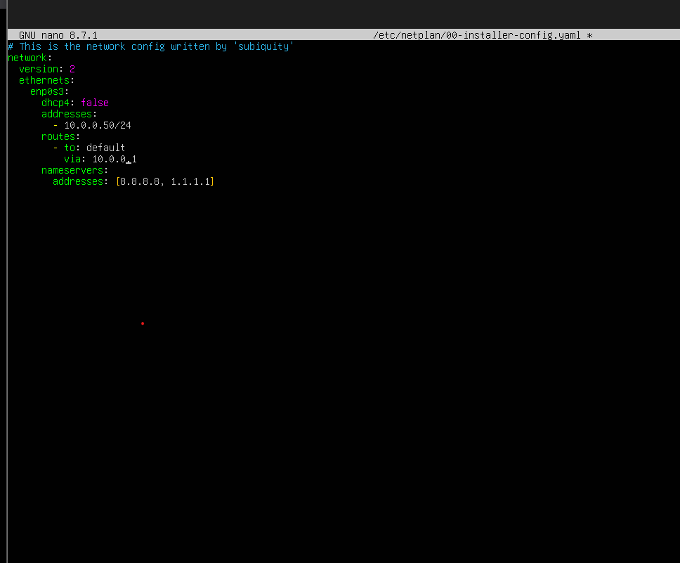

`ip a` muestra la IP asignada (`10.0.0.50/24`), aunque esta no es alcanzable desde/hacia la red física real:

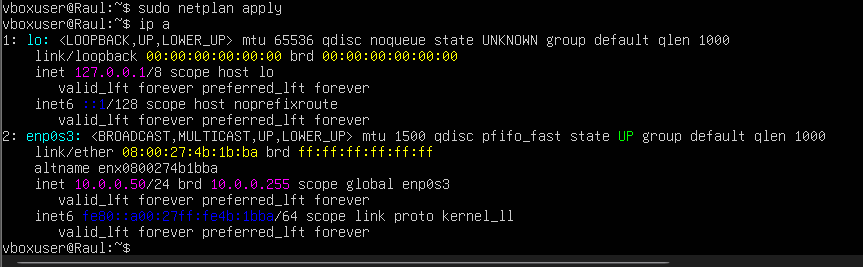

**Prueba de conectividad — `ping -c 4 google.com`:**

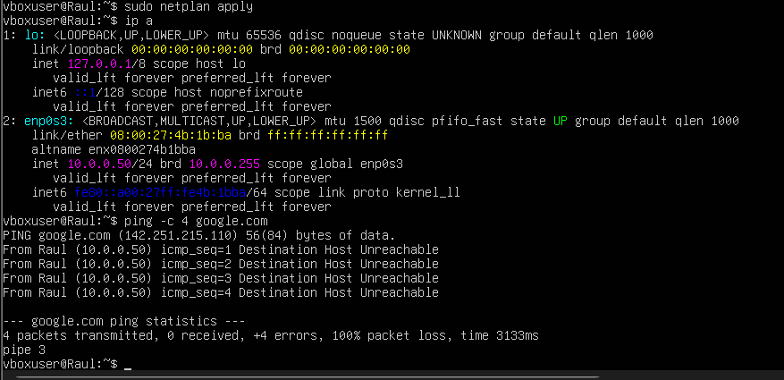

`Resultado: 4 paquetes transmitidos, 0 recibidos, 100% de pérdida — Destination Host Unreachable` ❌

Esto comprueba que, al asignar una IP fuera del rango/subred de la red física a la que está puenteado el adaptador Bridge, la máquina virtual pierde la ruta hacia el gateway real y por lo tanto no hay salida a Internet.

---

## 4. Resumen de resultados

| Escenario | Modo de red | Método | IP asignada | Ping a `google.com` | Resultado |
|---|---|---|---|---|---|
| 1 | Bridge | DHCP | `192.168.1.13/24` | 4/4 recibidos, 0% pérdida | ✅ Éxito |
| 2 | Bridge | Estática (misma red) | `192.168.1.50/24` | 4/4 recibidos, 0% pérdida | ✅ Éxito |
| 3 | Bridge | Estática (otra red) | `10.0.0.50/24` | 0/4 recibidos, 100% pérdida | ❌ Falla |

**Conclusión:** con el adaptador en modo `Bridge`, la VM se comporta como un equipo más de la red física, por lo que la conectividad solo se mantiene cuando su IP (por `DHCP` o estática) pertenece a la subred real de esa red (`192.168.1.0/24`). Al forzar una dirección fuera de ese rango (`10.0.0.0/24`), la puerta de enlace `10.0.0.1` no existe en la red física, lo que provoca `Destination Host Unreachable` en cada intento de `ping`.
