# Laboratorio IPSec Tunnel Mode — HTTPS entre dos redes

Configuración de una conexión IPSec (modo túnel) entre dos routers que
enlazan dos redes con subnets distintas, simulando Internet con un
tercer router, y verificación de un servicio web accesible entre ambas
redes a través del túnel.

## Topología

- **PC1** — 192.168.10.10/24 (Red A)
- **R1** — Gi0/0 192.168.10.1/24 · Gi0/1 200.1.1.1/30
- **R-ISP** — Gi0/0 200.1.1.2/30 · Gi0/1 200.2.2.1/30 (simula Internet)
- **R2** — Gi0/1 200.2.2.2/30 · Gi0/0 192.168.20.1/24
- **Server0** — 192.168.20.10/24 (Red B), servicio HTTP activo

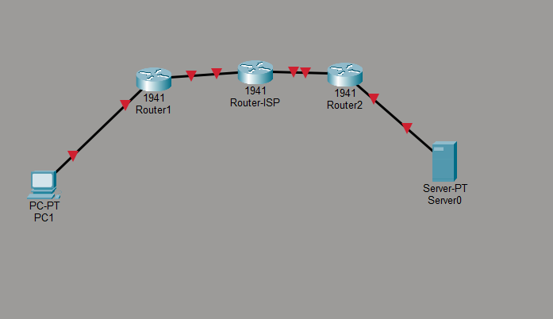

## Paso a paso

### 1. Configurar R1 (interfaces y ruta por defecto)
Hostname, `Gi0/0` hacia la LAN interna, `Gi0/1` hacia R-ISP y ruta por
defecto apuntando a R-ISP.

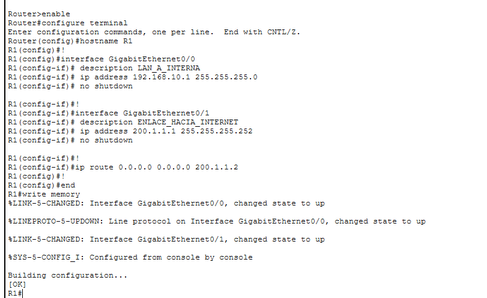

Estado de R1 tras aplicar la configuración:

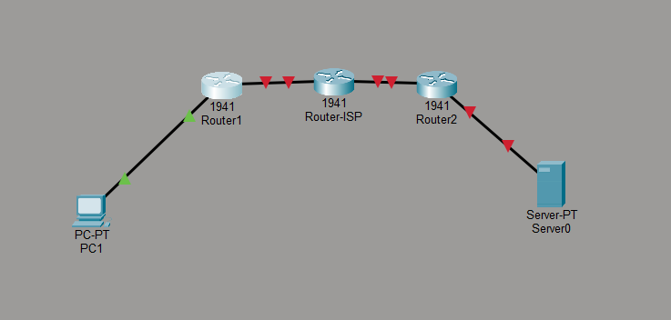

### 2. Configurar R-ISP (simula Internet)
Hostname, ambas interfaces WAN y rutas estáticas hacia las dos LAN
internas (192.168.10.0/24 y 192.168.20.0/24), para que el tráfico
pueda cruzar entre R1 y R2.

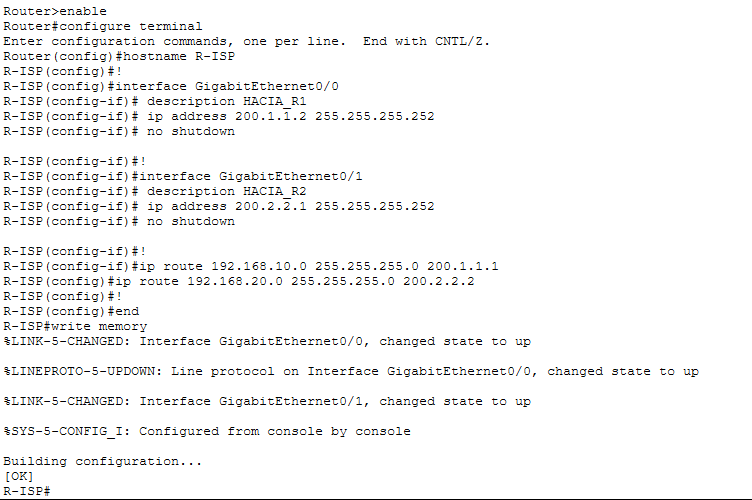

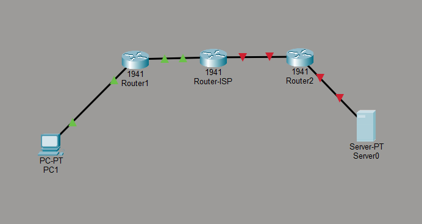

### 3. Configurar R2 (interfaces y ruta por defecto)
Análogo a R1: hostname, `Gi0/0` hacia la LAN interna, `Gi0/1` hacia
R-ISP y ruta por defecto.

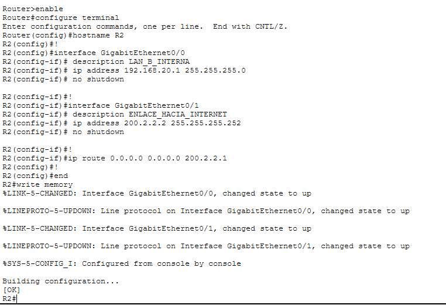

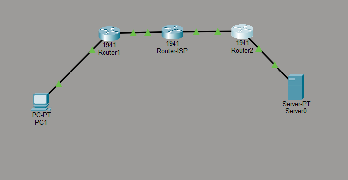

### 4. Activar la licencia de seguridad en R1 (securityk9)
Necesaria para poder usar los comandos de `crypto` en el IOS.

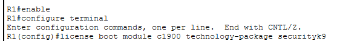

Aceptar el EULA y confirmar que el nivel de licencia queda en
`securityk9`:

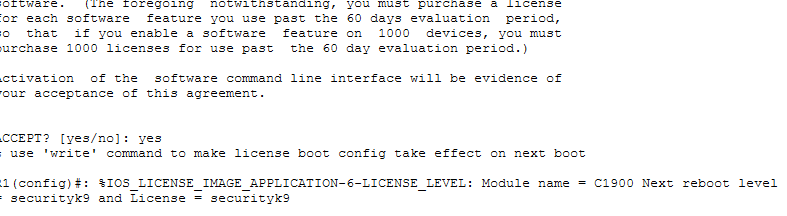

### 5. Guardar y reiniciar R1
Se guarda la configuración y se reinicia el router para que la
licencia tome efecto.

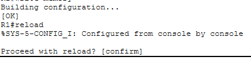

Arranque del router con la licencia ya activa:

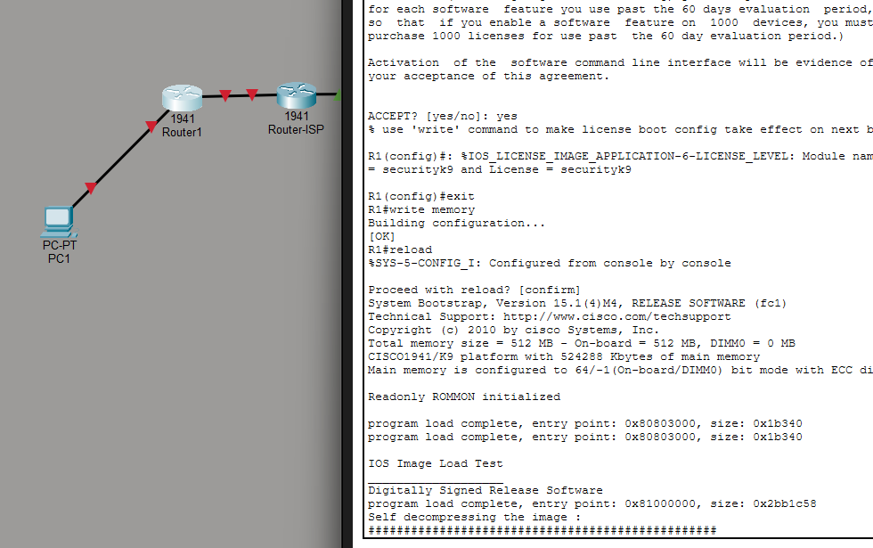

### 6. Configurar IPSec en R1 — Fase 1 (ISAKMP)
Policy 10 con AES-256, hash SHA, autenticación por llave
precompartida, grupo Diffie-Hellman 2, lifetime 86400s, y la llave
precompartida apuntando al peer (R2, 200.2.2.2).

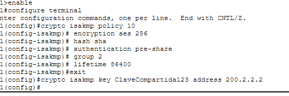

### 7. Fase 2 — Transform-set, ACL, Crypto Map en R1
Transform-set `TS_TUNEL` en modo túnel, ACL 100 con el tráfico
interesante (Red A → Red B), crypto map `MAPA_VPN` enlazando peer,
transform-set y ACL, aplicado sobre `Gi0/1`. El log confirma
`ISAKMP is ON`.

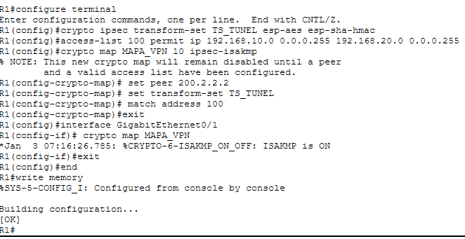

### 8. Activar la licencia de seguridad en R2
Mismo procedimiento que en R1 (nótese el primer intento fallido antes
de entrar a modo privilegiado/config correctamente).

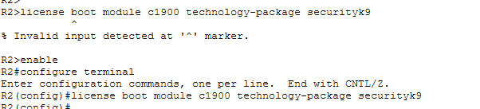

### 9. Guardar y reiniciar R2
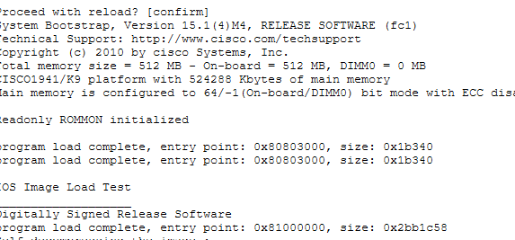

### 10. Configurar IPSec completo en R2 (Fase 1 + Fase 2)
Configuración espejo a R1: ISAKMP, llave precompartida hacia
200.1.1.1, transform-set en modo túnel, ACL 100 (Red B → Red A),
crypto map aplicado a `Gi0/1`. El log confirma `ISAKMP is ON`.

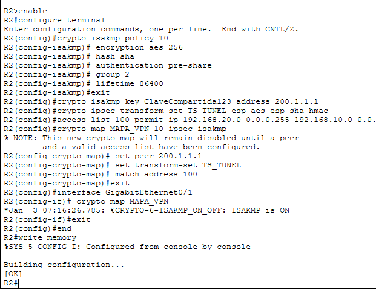

### 11. Activar el servidor web en Server0
Servicio HTTP habilitado, sirviendo los archivos por defecto
(`index.html`, `helloworld.html`, `image.html`, etc.):

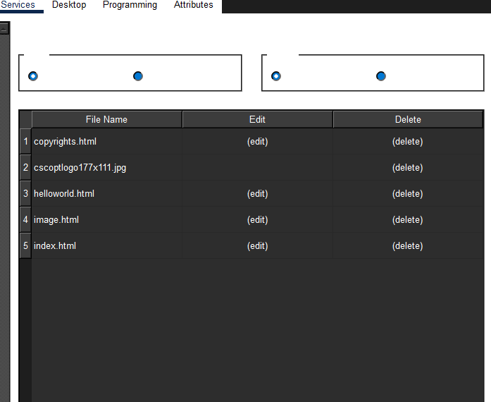

Direccionamiento IP estático del servidor (192.168.20.10/24,
gateway 192.168.20.1):

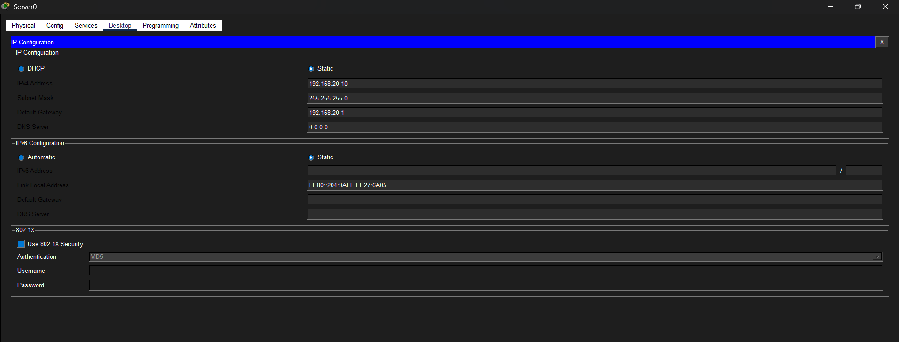

### 12. Probar desde PC1 (red opuesta)
Topología final con los tres routers y enlaces activos (flechas
verdes):

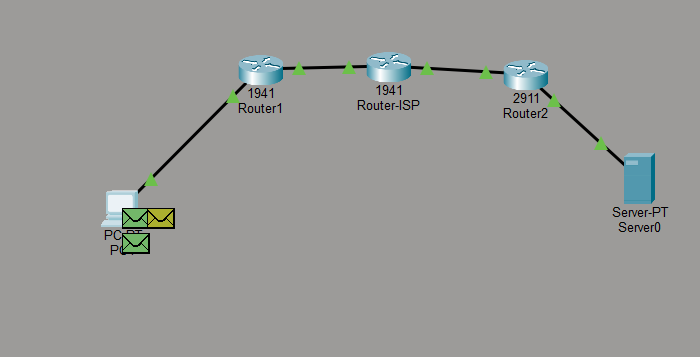

Ping desde PC1 hacia R1 (192.168.10.1), confirma conectividad local
antes de probar extremo a extremo:

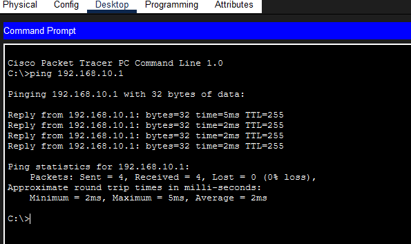

Flujo de la solicitud HTTP en Simulation Mode, mostrando el paso del
paquete por R1 → R-ISP → R2 → Server0 y su respuesta de vuelta:

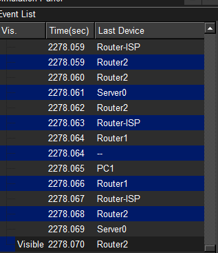

Respuesta del servidor web al navegar desde PC1 hacia
`http://192.168.20.10`: carga correctamente la página por defecto de
Packet Tracer, confirmando que el servicio HTTP funciona a través del
túnel IPSec:

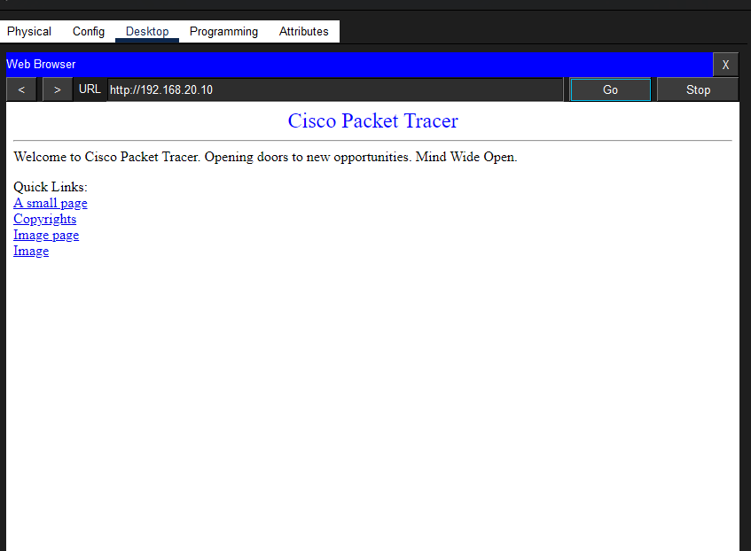

### 13. Verificación del túnel IPSec activo
Salida de `show crypto isakmp sa` y `show crypto ipsec sa` en R1,
confirmando el túnel en estado **QM_IDLE** entre 200.1.1.1 y
200.2.2.2, y contadores `#pkts encaps` / `#pkts decaps` mayores a 0
(tráfico real cifrado entre 192.168.10.0/24 y 192.168.20.0/24):

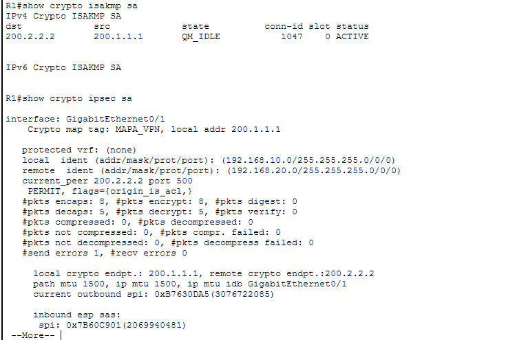

## Archivo de configuración

`packet-tracer/proyecto.pkt` — **pendiente**: agrega aquí tu archivo
`.pkt` real exportado desde Packet Tracer antes de subir esta carpeta
a la rama. Ver `PENDIENTE.txt`.
