# Assessment 02 – MetalLB + Traefik + 4 web apps on Minikube

This branch (`assessment-02`) documents how a single external IP, handed out by **MetalLB**, is used by **Traefik** to route four web applications by domain name inside a local **Minikube** cluster. All the configuration is written as IaC (YAML files in the `assessment-02/` folder).

> **Read this first – Windows limitation.** The cluster was built on **Windows 11 + Docker Desktop (Minikube Docker driver)**. In that setup the IP assigned by MetalLB (`192.168.49.240`) lives on a network that exists *only inside Docker's virtual machine*, so the Windows browser **cannot reach it directly**. The configuration itself is correct and was verified against `192.168.49.240` from inside the cluster; for the browser screenshots the `hosts` file was temporarily pointed to `127.0.0.1` and a `kubectl port-forward` was used. The full explanation, the evidence and every error found along the way are in [Section 7](#7-why-the-browser-cannot-reach-the-metallb-ip-on-windows) and [Section 9](#9-errors-found-and-how-they-were-solved).

---

## 1. Summary

| Item | Value |
|------|-------|
| Cluster | Minikube v1.39.0 (Kubernetes v1.37.0), Docker driver |
| Host OS | Windows 11 Home, Docker Desktop |
| MetalLB | v0.14.9, namespace `metallb-system` |
| MetalLB pool | `parcial-reaga-pool` → `192.168.49.240/32` (a single IP), advertised in Layer 2 by `parcial-reaga-l2` |
| Traefik | Helm chart `traefik/traefik` (Traefik v3.7.13), namespace `traefik`, Service type `LoadBalancer` |
| Traefik external IP | `192.168.49.240` (assigned by MetalLB) |
| Applications namespace | `parcial-reaga` |
| Applications | `web-nginx`, `web-apache`, `web-whoami`, `web-hello` (1 Deployment + 1 Service each) |
| Routing | 4 `Ingress` resources, class `traefik`, one host per application |
| Domain | `reaga.test` → `nginx.reaga.test`, `apache.reaga.test`, `whoami.reaga.test`, `hello.reaga.test` |

```text
 Browser / curl
      |  http://nginx.reaga.test  (hosts file -> 192.168.49.240)
      v
 [ MetalLB  192.168.49.240 ]   namespace: metallb-system
      |
      v
 [ Traefik (Service LoadBalancer) ]   namespace: traefik
      |  routes by Host header (Ingress rules)
      +--> web-nginx   --> pod nginx
      +--> web-apache  --> pod httpd
      +--> web-whoami  --> pod traefik/whoami
      +--> web-hello   --> pod nginxdemos/hello
                           namespace: parcial-reaga
```

### Files in this branch

```text
README.md
images/                          # screenshots used in this document
assessment-02/
├── metallb-config.yaml          # IPAddressPool + L2Advertisement
├── traefik-values.yaml          # Helm values: Service LoadBalancer with the MetalLB IP
├── apps.yaml                    # Namespace + 4 Deployments + 4 Services
└── ingress.yaml                 # 4 Ingress rules (one domain per app)
```

---

## 2. Cluster and IP range

The existing Minikube cluster was started with the Docker driver, and its node IP was used to choose a free IP in the same /24 network for the MetalLB pool:

```powershell
minikube start --driver=docker
minikube ip          # 192.168.49.2  -> pool IP chosen: 192.168.49.240
```

---

## 3. Step 1 – Install and configure MetalLB (own namespace: `metallb-system`)

MetalLB was installed from the official manifest (it creates its own namespace, `metallb-system`):

```powershell
kubectl apply -f https://raw.githubusercontent.com/metallb/metallb/v0.14.9/config/manifests/metallb-native.yaml
kubectl wait --namespace metallb-system --for=condition=ready pod --selector=app=metallb --timeout=120s
```

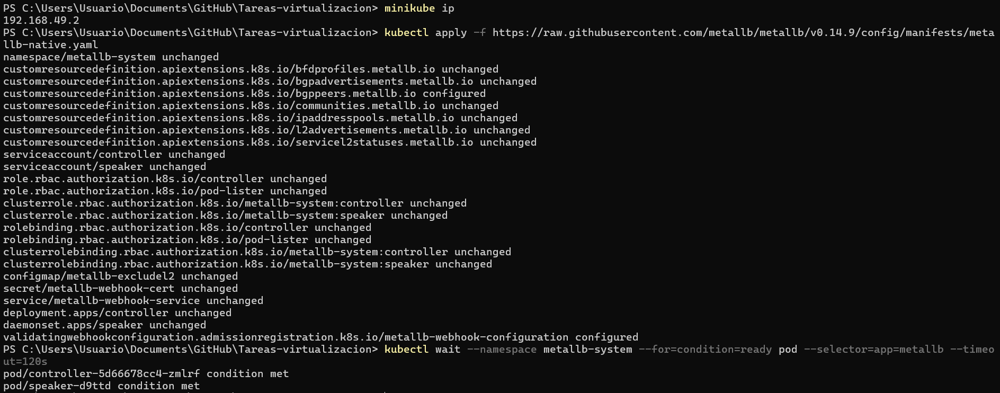

Then the single IP was declared as an `IPAddressPool` and advertised in Layer 2 (`assessment-02/metallb-config.yaml`):

```yaml
apiVersion: metallb.io/v1beta1
kind: IPAddressPool
metadata:
  name: parcial-reaga-pool
  namespace: metallb-system
spec:
  addresses:
  - 192.168.49.240/32
---
apiVersion: metallb.io/v1beta1
kind: L2Advertisement
metadata:
  name: parcial-reaga-l2
  namespace: metallb-system
spec:
  ipAddressPools:
  - parcial-reaga-pool
```

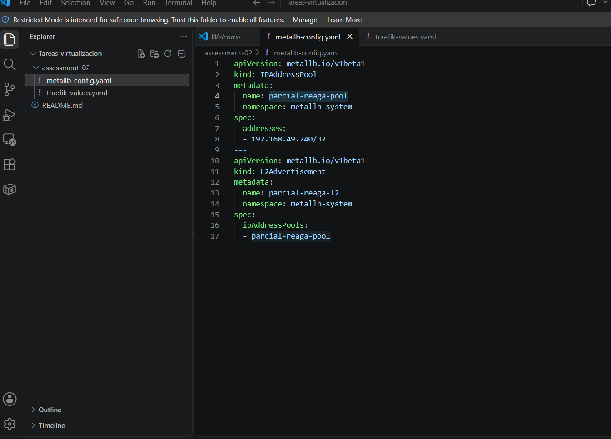

```powershell
kubectl apply -f assessment-02\metallb-config.yaml
kubectl get pods -n metallb-system
kubectl get ipaddresspools -n metallb-system
```

The `controller` and `speaker` pods are `Running` and the pool `parcial-reaga-pool` exposes exactly one address, `192.168.49.240/32`.

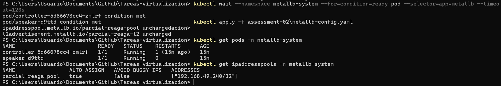

---

## 4. Step 2 – Install Traefik with a LoadBalancer Service (own namespace: `traefik`)

Traefik was installed with Helm in its own namespace. The values file asks MetalLB for the specific IP through an annotation (`assessment-02/traefik-values.yaml`):

```yaml
service:
  type: LoadBalancer
  annotations:
    metallb.io/loadBalancerIPs: 192.168.49.240
```

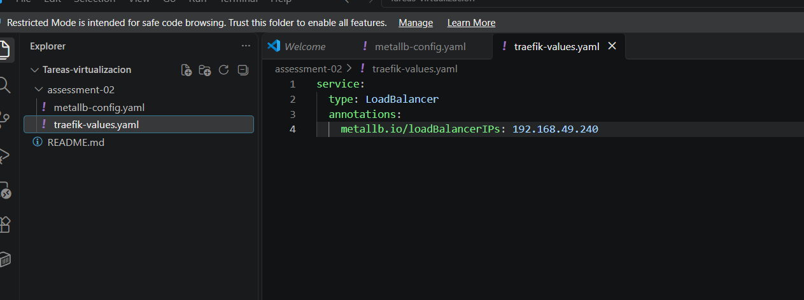

```powershell
helm repo add traefik https://traefik.github.io/charts
helm repo update
helm install traefik traefik/traefik -n traefik --create-namespace -f assessment-02\traefik-values.yaml
```

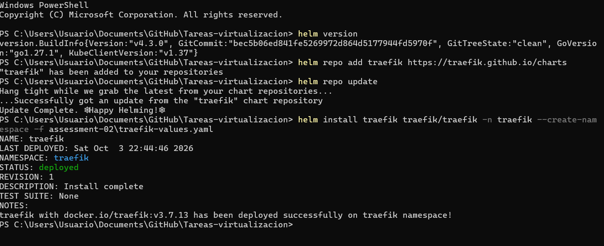

```powershell
kubectl get pods -n traefik
kubectl get svc -n traefik
```

The Traefik pod is `Running` and the `traefik` Service is of type `LoadBalancer` with **`EXTERNAL-IP 192.168.49.240`**, the IP provided by MetalLB.

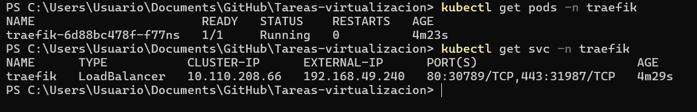

---

## 5. Step 3 – Four applications and four Services (namespace `parcial-reaga`)

The applications namespace follows the required pattern `parcial-` + initials (`parcial-reaga`). Four different web applications were chosen so that each domain shows a visibly different page:

| App | Image | What it shows |
|-----|-------|---------------|
| `web-nginx` | `nginx:alpine` | Nginx welcome page |
| `web-apache` | `httpd:alpine` | Apache "It works!" page |
| `web-whoami` | `traefik/whoami` | Request details (headers, pod name) |
| `web-hello` | `nginxdemos/hello` | Server name and address |

`assessment-02/apps.yaml` (Namespace + 4 Deployments + 4 ClusterIP Services):

```yaml
apiVersion: v1
kind: Namespace
metadata:
  name: parcial-reaga
---
apiVersion: apps/v1
kind: Deployment
metadata:
  name: web-nginx
  namespace: parcial-reaga
spec:
  replicas: 1
  selector:
    matchLabels:
      app: web-nginx
  template:
    metadata:
      labels:
        app: web-nginx
    spec:
      containers:
      - name: web
        image: nginx:alpine
        ports:
        - containerPort: 80
---
apiVersion: v1
kind: Service
metadata:
  name: web-nginx
  namespace: parcial-reaga
spec:
  selector:
    app: web-nginx
  ports:
  - port: 80
    targetPort: 80
---
apiVersion: apps/v1
kind: Deployment
metadata:
  name: web-apache
  namespace: parcial-reaga
spec:
  replicas: 1
  selector:
    matchLabels:
      app: web-apache
  template:
    metadata:
      labels:
        app: web-apache
    spec:
      containers:
      - name: web
        image: httpd:alpine
        ports:
        - containerPort: 80
---
apiVersion: v1
kind: Service
metadata:
  name: web-apache
  namespace: parcial-reaga
spec:
  selector:
    app: web-apache
  ports:
  - port: 80
    targetPort: 80
---
apiVersion: apps/v1
kind: Deployment
metadata:
  name: web-whoami
  namespace: parcial-reaga
spec:
  replicas: 1
  selector:
    matchLabels:
      app: web-whoami
  template:
    metadata:
      labels:
        app: web-whoami
    spec:
      containers:
      - name: web
        image: traefik/whoami
        ports:
        - containerPort: 80
---
apiVersion: v1
kind: Service
metadata:
  name: web-whoami
  namespace: parcial-reaga
spec:
  selector:
    app: web-whoami
  ports:
  - port: 80
    targetPort: 80
---
apiVersion: apps/v1
kind: Deployment
metadata:
  name: web-hello
  namespace: parcial-reaga
spec:
  replicas: 1
  selector:
    matchLabels:
      app: web-hello
  template:
    metadata:
      labels:
        app: web-hello
    spec:
      containers:
      - name: web
        image: nginxdemos/hello
        ports:
        - containerPort: 80
---
apiVersion: v1
kind: Service
metadata:
  name: web-hello
  namespace: parcial-reaga
spec:
  selector:
    app: web-hello
  ports:
  - port: 80
    targetPort: 80
```

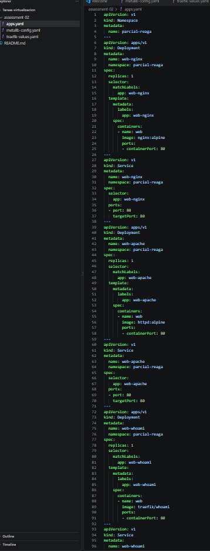

```powershell
kubectl apply -f assessment-02\apps.yaml
kubectl get pods -n parcial-reaga
kubectl get svc -n parcial-reaga
```

Right after the `apply`, the namespace, the four Deployments and the four Services were created. The first `get pods` was taken a few seconds later, while three pods were still in `ContainerCreating` (images being pulled); the four Services (`ClusterIP`, port 80) already existed.

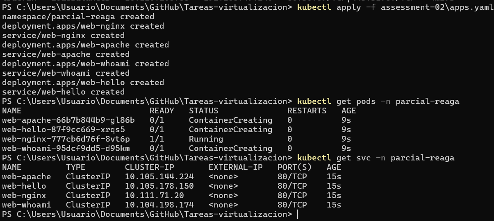

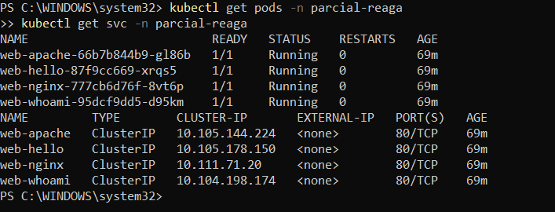

---

## 6. Step 4 – Ingress rules handled by Traefik (one domain per Service)

Each Service is exposed through an `Ingress` with `ingressClassName: traefik`, so Traefik reads it and routes by the `Host` header (`assessment-02/ingress.yaml`):

```yaml
apiVersion: networking.k8s.io/v1
kind: Ingress
metadata:
  name: web-nginx
  namespace: parcial-reaga
spec:
  ingressClassName: traefik
  rules:
  - host: nginx.reaga.test
    http:
      paths:
      - path: /
        pathType: Prefix
        backend:
          service:
            name: web-nginx
            port:
              number: 80
---
apiVersion: networking.k8s.io/v1
kind: Ingress
metadata:
  name: web-apache
  namespace: parcial-reaga
spec:
  ingressClassName: traefik
  rules:
  - host: apache.reaga.test
    http:
      paths:
      - path: /
        pathType: Prefix
        backend:
          service:
            name: web-apache
            port:
              number: 80
---
apiVersion: networking.k8s.io/v1
kind: Ingress
metadata:
  name: web-whoami
  namespace: parcial-reaga
spec:
  ingressClassName: traefik
  rules:
  - host: whoami.reaga.test
    http:
      paths:
      - path: /
        pathType: Prefix
        backend:
          service:
            name: web-whoami
            port:
              number: 80
---
apiVersion: networking.k8s.io/v1
kind: Ingress
metadata:
  name: web-hello
  namespace: parcial-reaga
spec:
  ingressClassName: traefik
  rules:
  - host: hello.reaga.test
    http:
      paths:
      - path: /
        pathType: Prefix
        backend:
          service:
            name: web-hello
            port:
              number: 80
```

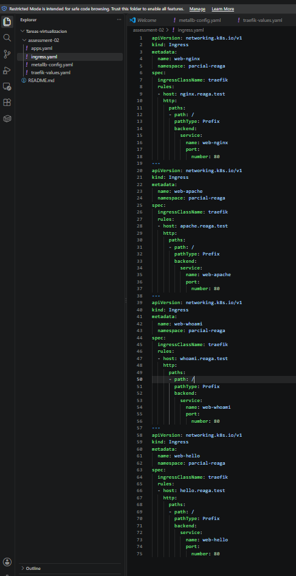

```powershell
kubectl apply -f assessment-02\ingress.yaml
kubectl get ingress -n parcial-reaga
```

The four Ingress resources use the `traefik` class and all show `ADDRESS 192.168.49.240`, the MetalLB IP that Traefik is using.

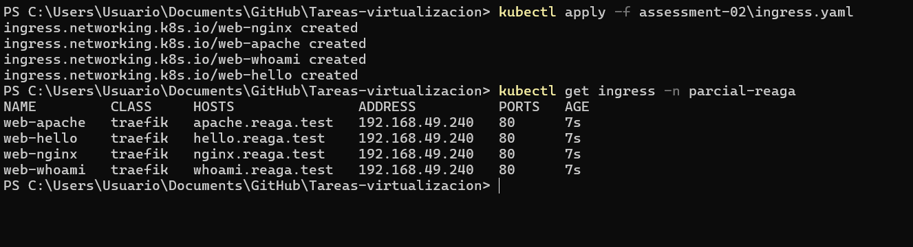

---

## 7. Why the browser cannot reach the MetalLB IP on Windows

The assignment asks to edit `/etc/hosts` so that four names point to the IP of the Traefik LoadBalancer. That works directly on a Linux host, and this is the reason it did **not** work directly on this machine:

1. **MetalLB only hands out IPs from a network it can announce.** In Minikube with the Docker driver, the "node" is a Docker container. Its network (`192.168.49.0/24`) is a Docker bridge, and MetalLB (Layer 2 mode) announces `192.168.49.240` on that bridge.
2. **On Linux, that bridge is part of the host.** Docker creates the bridge as a regular network interface of the Linux machine, so the host has a route to `192.168.49.0/24`. A `hosts` entry pointing to `192.168.49.240` and a browser on the same machine work with no extra steps.
3. **On Windows (and macOS), Docker Desktop runs inside a virtual machine.** The `192.168.49.0/24` bridge exists only inside that VM. Windows has no network interface or route for it, so any packet sent from Windows to `192.168.49.240` is never delivered and ends in a timeout. This is a known limitation of the Minikube Docker driver on Windows/macOS.

Evidence that this is a *reachability* problem of the host and not a configuration problem:

- From **inside** the cluster network, the same IP answers correctly and Traefik routes by domain name (this is the real test of MetalLB + Traefik + Ingress):

```powershell
minikube ssh "curl -s -H 'Host: nginx.reaga.test' http://192.168.49.240"
```

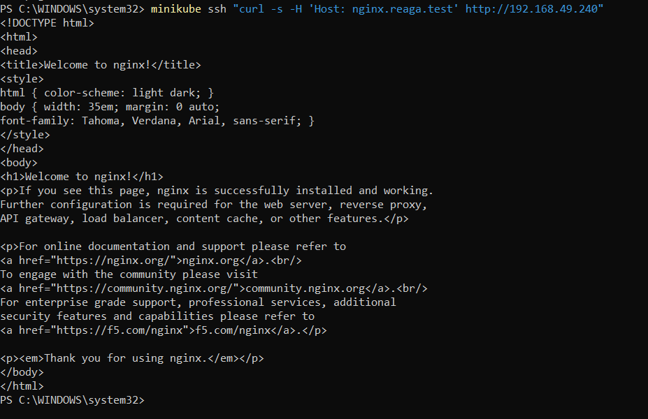

- From **Windows**, the same request to the IP times out (`curl: (28) Connection timed out`, and `ping` to `192.168.49.240` gets no reply). See [Section 9, errors 1–3](#9-errors-found-and-how-they-were-solved).

### How the browser evidence was produced

Because the browser could not use `192.168.49.240`, the traffic was brought to Traefik by another path, **without changing any Kubernetes configuration**:

1. The Windows `hosts` file was temporarily changed to `127.0.0.1` for the four names.
2. A port-forward was opened to the Traefik Service (the same Service that owns the MetalLB IP) and kept running while the screenshots were taken:

```powershell
kubectl port-forward -n traefik svc/traefik 80:80 --address 127.0.0.1
```

3. The browser was opened with the domain names (`http://nginx.reaga.test`, etc.). The request enters Traefik exactly as it would from the MetalLB IP, and Traefik routes it by `Host` header to the right application. The `whoami` page confirms it: its headers include `X-Forwarded-Host: whoami.reaga.test` and `X-Forwarded-Server: traefik-...`.
4. When the screenshots were finished, the port-forward was stopped and the `hosts` file was restored to the required value (`192.168.49.240`), see [Section 8](#8-dns-configuration-hosts-file).

---

## 8. DNS configuration (hosts file)

The local DNS is configured in the Windows equivalent of `/etc/hosts`: `C:\Windows\System32\drivers\etc\hosts`. Four names of a domain chosen for this assignment (`reaga.test`, no purchase needed) point to the IP of the Traefik LoadBalancer:

```text
192.168.49.240 nginx.reaga.test
192.168.49.240 apache.reaga.test
192.168.49.240 whoami.reaga.test
192.168.49.240 hello.reaga.test
```

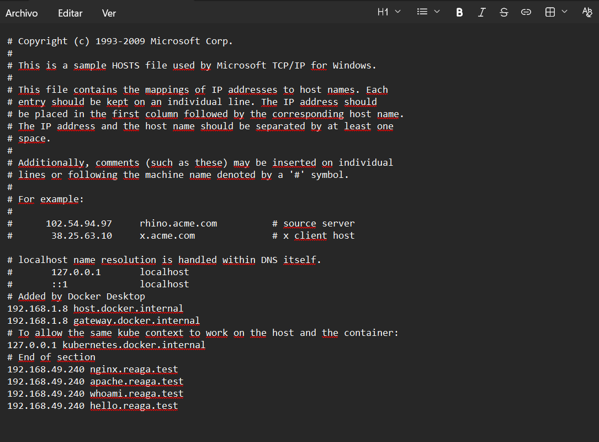

Because the file is protected, it had to be edited from an administrator session (see [error 7](#9-errors-found-and-how-they-were-solved) for what happened with Notepad).

### Browser access using the domain names

With the temporary `127.0.0.1` mapping and the port-forward described in Section 7, the four services are reached **by domain name** and each one shows a different application:

**`http://nginx.reaga.test`**

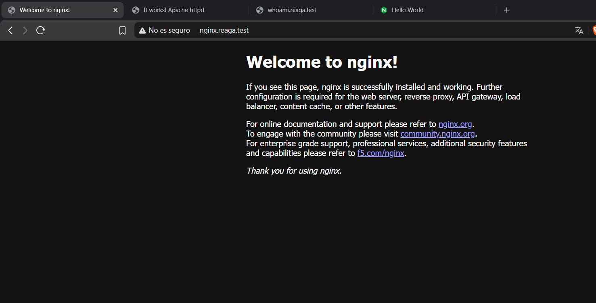

**`http://apache.reaga.test`**

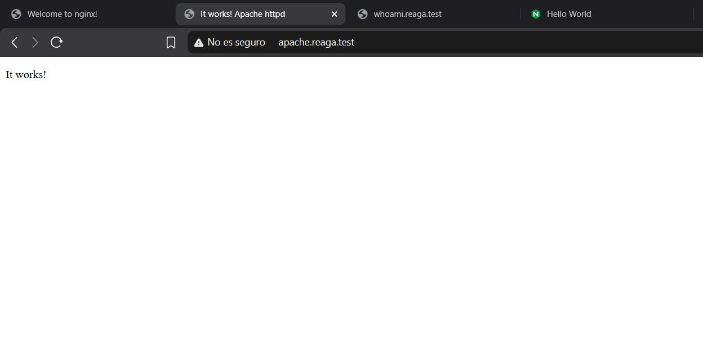

**`http://whoami.reaga.test`**

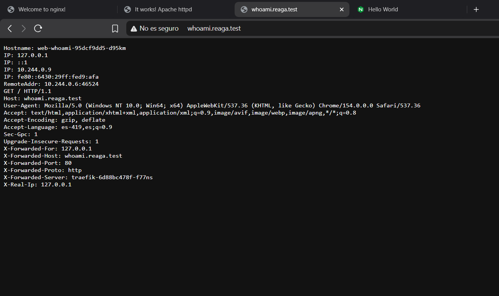

**`http://hello.reaga.test`**

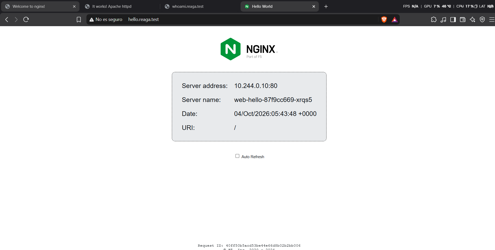

### Final state of the hosts file

After the screenshots, the file was restored to the configuration requested by the assignment (names → `192.168.49.240`) with:

```powershell
(Get-Content C:\Windows\System32\drivers\etc\hosts) -replace '^127\.0\.0\.1 (nginx|apache|whoami|hello)\.reaga\.test', '192.168.49.240 $1.reaga.test' | Set-Content -Encoding ascii C:\Windows\System32\drivers\etc\hosts
ipconfig /flushdns
Get-Content C:\Windows\System32\drivers\etc\hosts
```

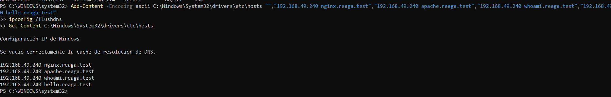

---

## 9. Errors found and how they were solved

These are the problems that appeared while trying to open the services from the Windows browser, in the order they happened. Errors 1–5 come from the Windows/Docker networking limitation explained in Section 7; errors 6–9 are about port 80 and editing the `hosts` file. None of them required changes to MetalLB, Traefik, the Services or the Ingress.

### Error 1 – Timeout when calling the MetalLB IP from Windows

- **Symptom:** with the `hosts` file pointing to `192.168.49.240`, `curl.exe -m 5 http://nginx.reaga.test` ends with `curl: (28) Connection timed out after 5003 milliseconds`, and `ping -n 1 nginx.reaga.test` shows `[192.168.49.240]` with *"Tiempo de espera agotado"* (100 % loss).
- **Cause:** Windows has no route to the Docker bridge network where MetalLB announces the IP (Section 7).
- **How it was diagnosed:** the same request made from inside the cluster (`minikube ssh "curl -s -H 'Host: nginx.reaga.test' http://192.168.49.240"`) returns the Nginx page, so MetalLB, Traefik and the Ingress work. Also, `curl.exe -m 5 -H "Host: nginx.reaga.test" http://127.0.0.1` (with the port-forward running) returns the page, proving the routing by `Host` header.

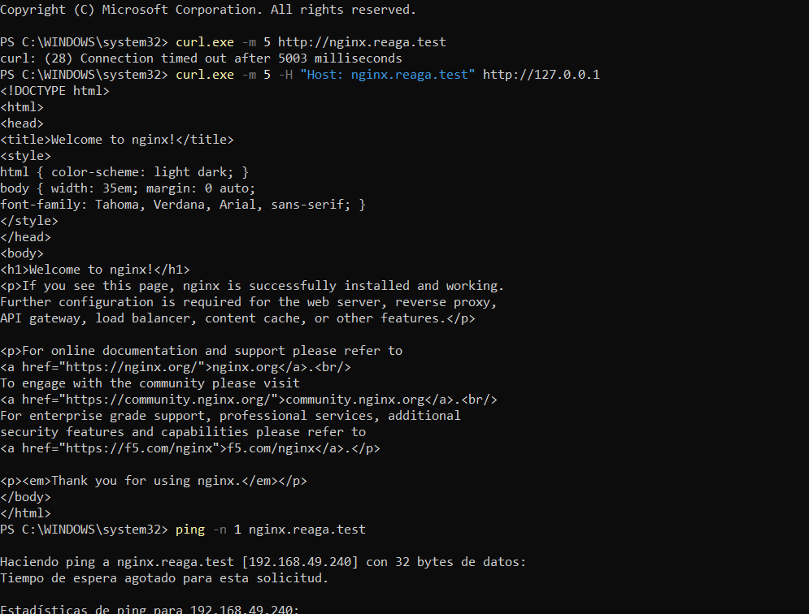

### Error 2 – Loopback alias + proxy container: "Empty reply from server"

- **What was tried:** assign `192.168.49.240` to the Windows loopback adapter and run a `socat` container attached to the Minikube Docker network, publishing port 80, to forward traffic to the MetalLB IP:

```powershell
New-NetIPAddress -InterfaceAlias "Loopback Pseudo-Interface 1" -IPAddress 192.168.49.240 -PrefixLength 32
docker run -d --name lb-proxy --network minikube -p 80:80 --restart unless-stopped alpine/socat tcp-listen:80,fork,reuseaddr tcp-connect:192.168.49.240:80
```

- **Result:** `curl: (52) Empty reply from server` for `nginx.reaga.test` and `whoami.reaga.test`. The request reached the proxy container, but the container could not get an answer from the MetalLB IP, so the connection was closed.
- **Solution:** the approach was discarded and cleaned up (`Remove-NetIPAddress -InterfaceAlias "Loopback Pseudo-Interface 1" -IPAddress 192.168.49.240`, `docker rm -f lb-proxy`).

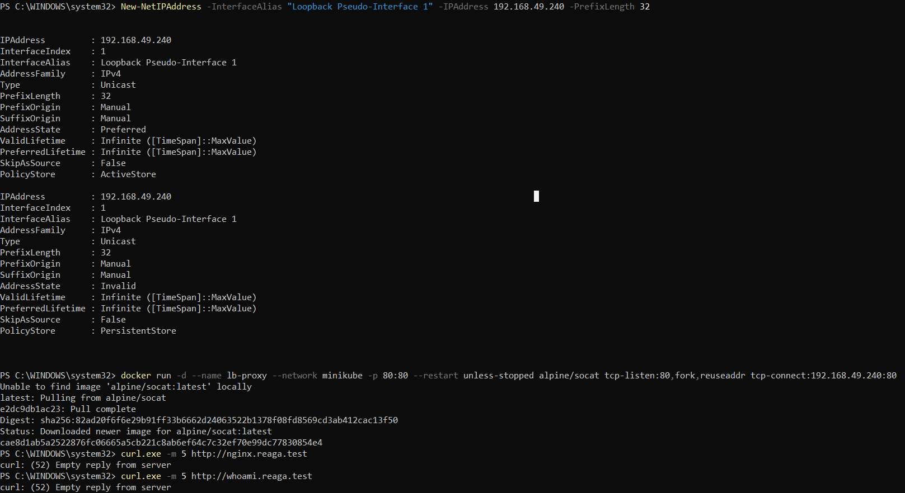

### Error 3 – Static route to the Minikube node: still a timeout

- **What was tried:** `route add 192.168.49.240 mask 255.255.255.255 192.168.49.2` (send the MetalLB IP through the Minikube node IP). The command returned `Correcto`.
- **Result:** both `curl.exe -m 5 http://nginx.reaga.test` and `http://whoami.reaga.test` still ended with `curl: (28) Connection timed out`.
- **Cause:** the node IP `192.168.49.2` is also inside the Docker VM network, so Windows cannot deliver packets to it either.
- **Solution:** the route was removed (`route delete 192.168.49.240`).

### Error 4 – `minikube tunnel` did not fix the access through the MetalLB IP

- **What was tried:** `minikube tunnel`. It started tunnels for the `traefik` Service and the application Services (output: `Tunnel successfully started`, `Starting tunnel for service traefik.` …) and warned that ports below 1024 may fail on Windows.
- **Result:** with the `hosts` file still on `192.168.49.240`, `curl.exe -m 5 http://nginx.reaga.test` kept timing out. The tunnel exposes services on `127.0.0.1`, not on the MetalLB IP.
- **Side effect:** the tunnel left `kubectl` and `ssh` processes holding port 80 (see error 6).

### Error 5 – Port-forward bound to the MetalLB IP

- **What was tried:** `kubectl port-forward -n traefik svc/traefik 80:80 --address 0.0.0.0,192.168.49.240`.
- **Result:** `unable to create listener: Error listen tcp4 192.168.49.240:80: bind: The requested address is not valid in its context.`
- **Cause:** `192.168.49.240` is not an address of any Windows network interface, so Windows cannot listen on it.
- **Solution:** listen only on `127.0.0.1` and point the `hosts` file to `127.0.0.1` for the screenshots (Section 7).

### Error 6 – Port 80 already in use

- **Symptom:** `kubectl port-forward -n traefik deployment/traefik 80:8000 --address 127.0.0.1` fails with `bind: Only one usage of each socket address (protocol/network address/port) is normally permitted.`
- **Diagnosis:** `Get-Process -Id (Get-NetTCPConnection -LocalPort 80 -ErrorAction SilentlyContinue).OwningProcess` showed one `kubectl` process (Id 5080) and two `ssh` processes (Id 14292 and 21800), leftovers of the tunnel and earlier port-forwards.
- **Solution:** the processes were stopped (`Stop-Process -Id 5080, 14292, 21800 -Force`) and `Get-NetTCPConnection -LocalPort 80` returned nothing (port free). Then `kubectl port-forward -n traefik svc/traefik 80:80 --address 127.0.0.1` worked and printed `Forwarding from 127.0.0.1:80 -> 8000` followed by `Handling connection for 80` for each request.

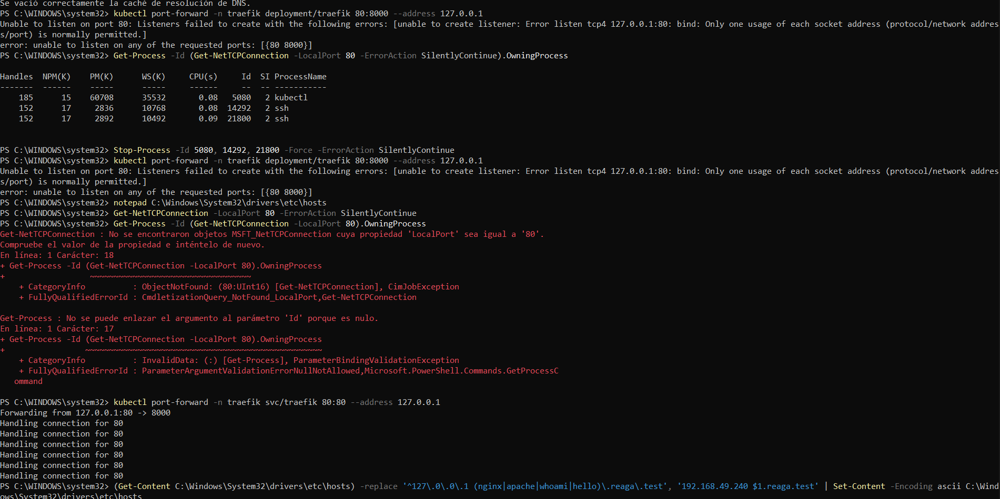

### Error 7 – The `hosts` file could not be edited with `Add-Content`

- **Symptom:** the `Add-Content ... "192.168.49.240 nginx.reaga.test"` commands returned an error in PowerShell, because the file is protected.
- **Solution:** the file was edited with Notepad opened from an administrator terminal: `notepad C:\Windows\System32\drivers\etc\hosts`.

### Error 8 – Notepad showed `127.0.0.1` but the file still had `192.168.49.240`

- **Symptom:** after changing the four lines to `127.0.0.1` in Notepad, `ping nginx.reaga.test` still resolved to `[192.168.49.240]`. Reading the real file with `Get-Content C:\Windows\System32\drivers\etc\hosts` showed the four old lines, and `dir C:\Windows\System32\drivers\etc` showed a single `hosts` file (so it was not saved as `hosts.txt`).
- **Cause:** the change was never written to disk; Notepad was still showing its own unsaved text.
- **How it was detected:** always verify the real file with `Get-Content ... | Select-String reaga` instead of trusting the editor window.

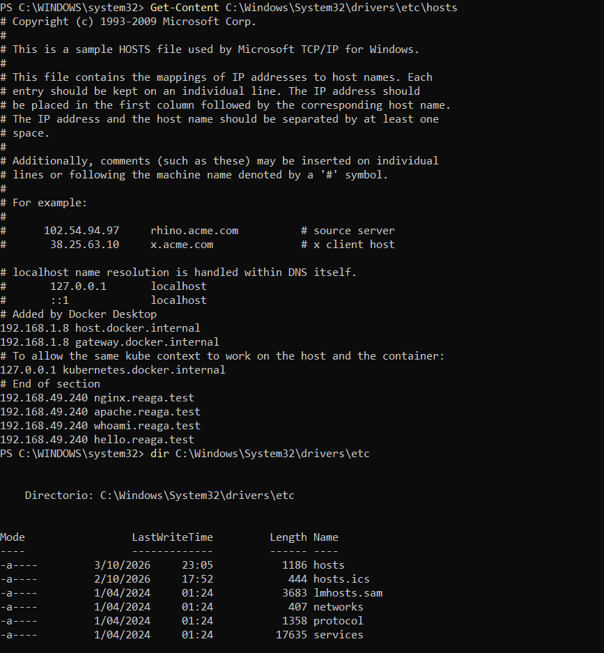

### Error 9 – `Set-Content`: "the file is being used by another process"

- **Symptom:** the replacement command (`(Get-Content ...) -replace '^192\.168\.49\.240 ', '127.0.0.1 ' | Set-Content -Encoding ascii ...`) failed with *"El proceso no puede obtener acceso al archivo ... porque está siendo utilizado en otro proceso"*.
- **Cause:** the Notepad window left open was holding the file.
- **Solution:** Notepad was closed (`Get-Process notepad -ErrorAction SilentlyContinue | Stop-Process -Force`). After that the four lines disappeared from the file, so they were added again with `Add-Content -Encoding ascii C:\Windows\System32\drivers\etc\hosts "","127.0.0.1 nginx.reaga.test", ...`. The result was verified with `Select-String reaga`, the DNS cache was cleared (`ipconfig /flushdns`) and `ping -n 1 nginx.reaga.test` finally resolved to `[127.0.0.1]`.

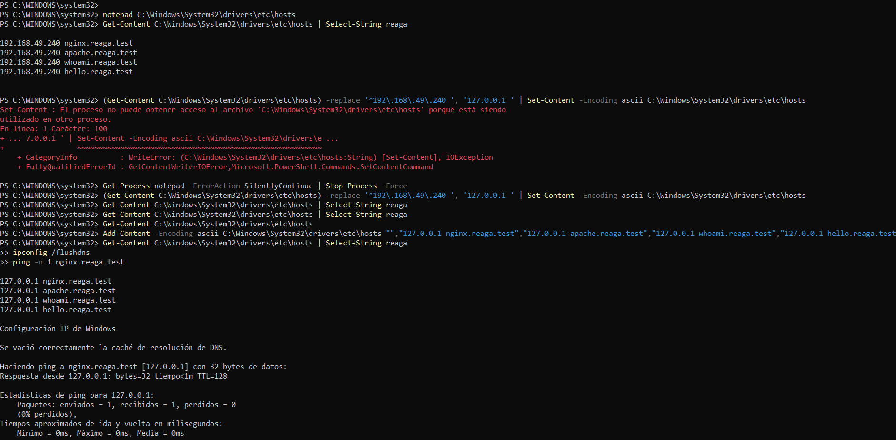

With the `hosts` file correct and the port-forward running, `curl.exe -m 5 http://nginx.reaga.test` returned the Nginx page, and the browser screenshots of Section 8 were taken.

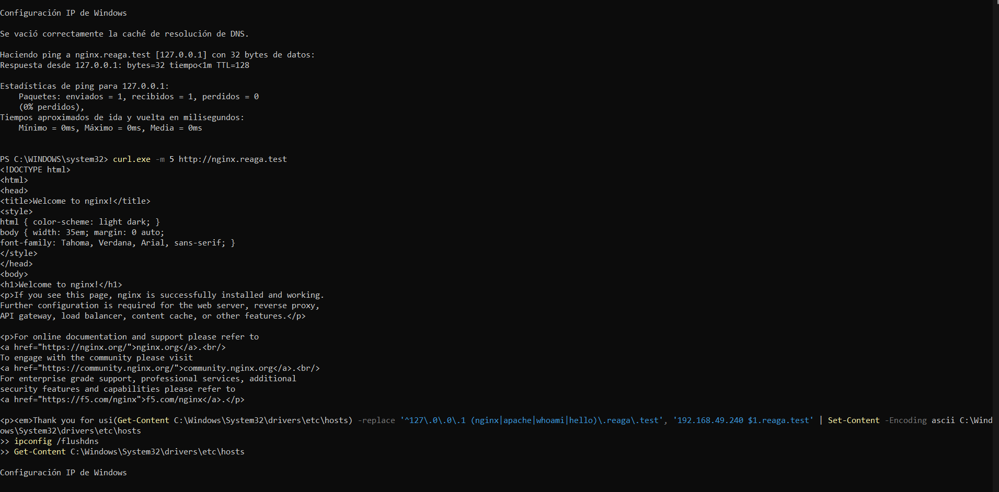

---

## 10. Result against the requirements

| Requirement | Status | Evidence |
|-------------|--------|----------|
| MetalLB installed, one IP, own namespace | Done | Section 3 (`metallb-system`, pool `192.168.49.240/32`) |
| Traefik installed, Service `LoadBalancer` using the MetalLB IP, own namespace | Done | Section 4 (`traefik`, `EXTERNAL-IP 192.168.49.240`) |
| 4 Deployments of web applications | Done | Section 5 |
| 4 Services, one per Deployment, handled by Traefik | Done | Sections 5 and 6 (Services + Ingress class `traefik`) |
| Namespace `parcial-` + initials | Done | `parcial-reaga` |
| 4 local DNS names pointing to the Traefik LoadBalancer IP | Done | Section 8 (`hosts` → `192.168.49.240`) |
| All the configuration as IaC (YAML) | Done | `assessment-02/*.yaml` |
| Screenshots of every service by domain name | Done | Section 8. Taken with `hosts` → `127.0.0.1` + port-forward because of the Windows/Docker limitation (Section 7); the same routing through `192.168.49.240` is verified in Section 7 |

### How to reproduce

```powershell
minikube start --driver=docker
kubectl apply -f https://raw.githubusercontent.com/metallb/metallb/v0.14.9/config/manifests/metallb-native.yaml
kubectl wait --namespace metallb-system --for=condition=ready pod --selector=app=metallb --timeout=120s
kubectl apply -f assessment-02\metallb-config.yaml
helm repo add traefik https://traefik.github.io/charts
helm repo update
helm install traefik traefik/traefik -n traefik --create-namespace -f assessment-02\traefik-values.yaml
kubectl apply -f assessment-02\apps.yaml
kubectl apply -f assessment-02\ingress.yaml
```

On a Linux host, add the four names to `/etc/hosts` pointing to `192.168.49.240` and open them directly in the browser. On Windows/macOS with the Docker driver, use `kubectl port-forward -n traefik svc/traefik 80:80 --address 127.0.0.1` with the names mapped to `127.0.0.1`.
