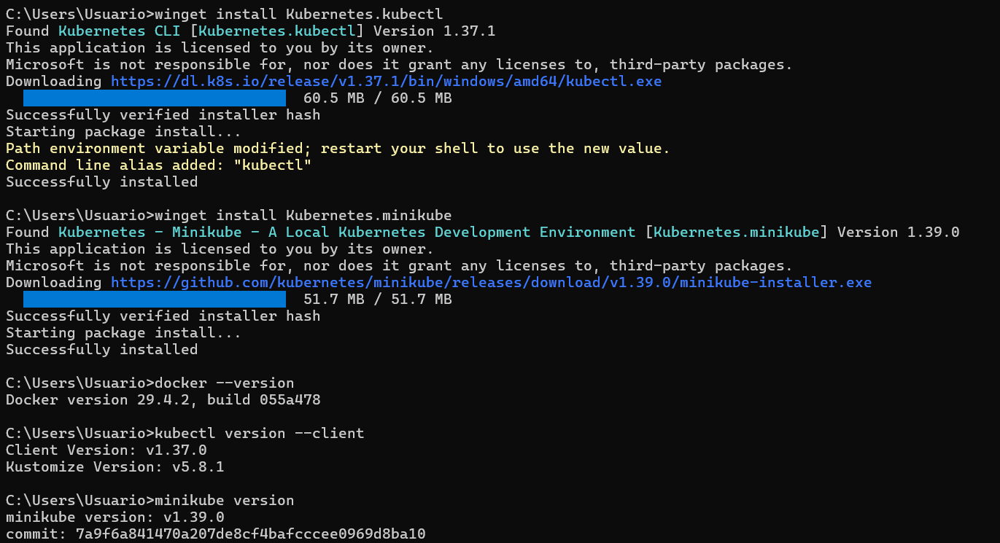
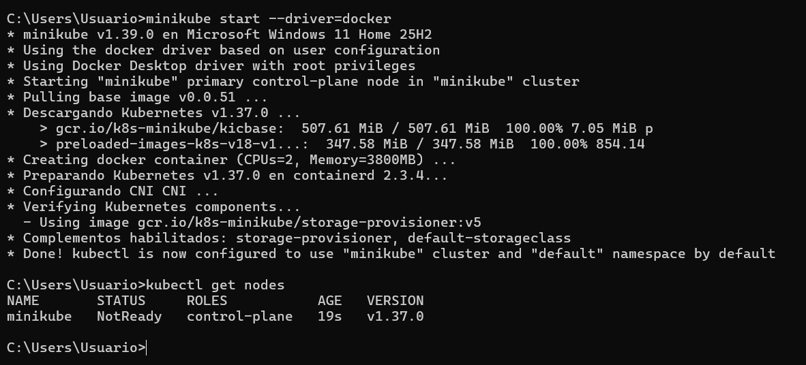
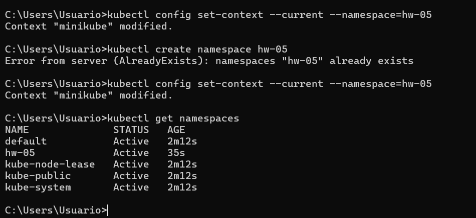
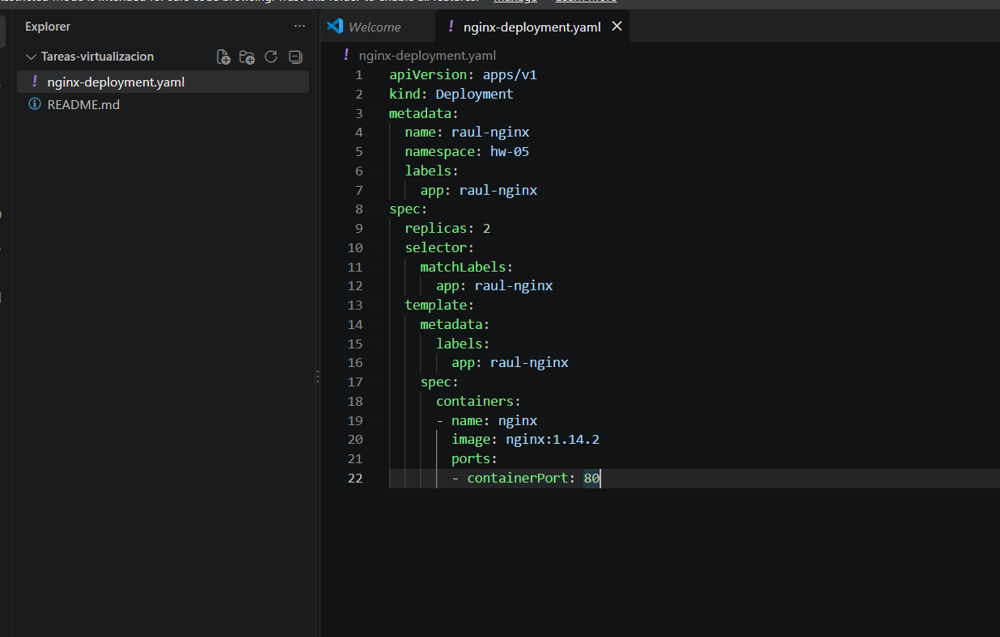
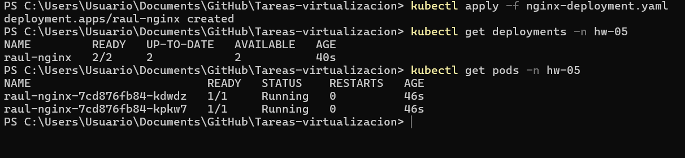
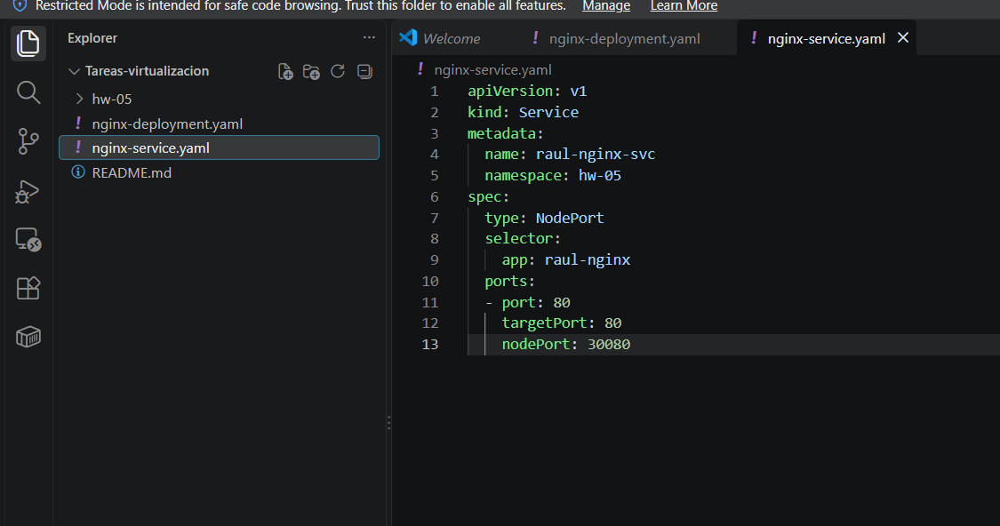
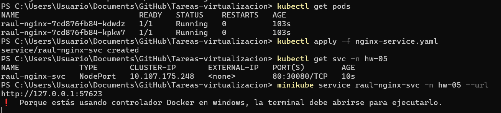
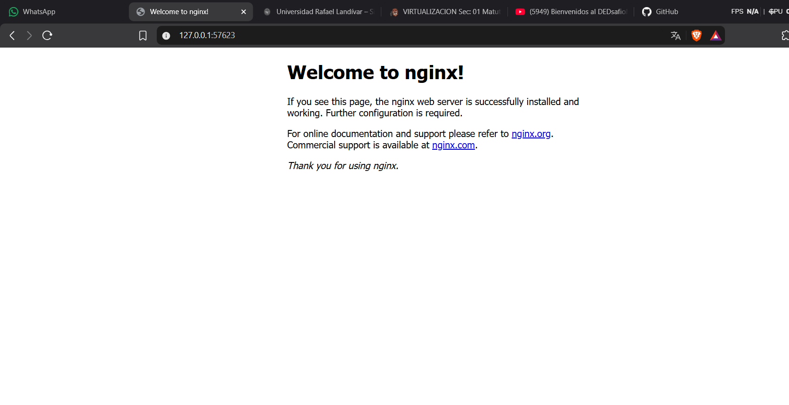

# HW-05 – Exposing Nginx with a Kubernetes Service

This assignment deploys the basic Nginx example from the
[Kubernetes Deployment documentation](https://kubernetes.io/docs/concepts/workloads/controllers/deployment/#creating-a-deployment)
on a local cluster and exposes it through a `NodePort` Service so it can be opened from a local browser.

**Environment:** Windows 11, Docker Desktop, kubectl, minikube (Docker driver)
**Namespace:** `hw-05`
**Branch:** `hw-05` (created from `main`)

---

## Step 1 – Install the required tools

Nginx does not need to be installed on the machine: Kubernetes pulls it as a container image.
The tools required are Docker Desktop (container runtime), `kubectl` (cluster CLI) and `minikube` (local cluster).

```powershell
winget install Kubernetes.kubectl
winget install Kubernetes.minikube
```

All three installations were verified with:

```powershell
docker --version
kubectl version --client
minikube version
```



---

## Step 2 – Start the local cluster

```powershell
minikube start --driver=docker
kubectl get nodes
```

The cluster was created with the Docker driver. The node showed `NotReady` right after startup
(it was only 19 seconds old) and becomes `Ready` shortly after.



---

## Step 3 – Create the namespace and set it as default

```powershell
kubectl create namespace hw-05
kubectl config set-context --current --namespace=hw-05
kubectl get namespaces
```

The namespace `hw-05` already existed when `create` was run (`AlreadyExists`), so the context was
simply set to use it by default. `kubectl get namespaces` confirms it is `Active`.



---

## Step 4 – Write the Nginx Deployment manifest

File: `nginx-deployment.yaml` (based on the official Kubernetes example, with 2 replicas and the
`hw-05` namespace).

```yaml
apiVersion: apps/v1
kind: Deployment
metadata:
  name: raul-nginx
  namespace: hw-05
  labels:
    app: raul-nginx
spec:
  replicas: 2
  selector:
    matchLabels:
      app: raul-nginx
  template:
    metadata:
      labels:
        app: raul-nginx
    spec:
      containers:
      - name: nginx
        image: nginx:1.14.2
        ports:
        - containerPort: 80
```



---

## Step 5 – Apply the Deployment

```powershell
kubectl apply -f nginx-deployment.yaml
kubectl get deployments -n hw-05
kubectl get pods -n hw-05
```

The Deployment is `2/2` ready and both pods are in `Running` status.



---

## Step 6 – Create the Service to expose the port

File: `nginx-service.yaml`. The `selector` matches the `app: raul-nginx` label of the Deployment,
and the Service is of type `NodePort`, exposing port `80` through node port `30080`.

```yaml
apiVersion: v1
kind: Service
metadata:
  name: raul-nginx-svc
  namespace: hw-05
spec:
  type: NodePort
  selector:
    app: raul-nginx
  ports:
  - port: 80
    targetPort: 80
    nodePort: 30080
```



```powershell
kubectl apply -f nginx-service.yaml
kubectl get svc -n hw-05
minikube service raul-nginx-svc -n hw-05 --url
```

### Output of `kubectl get svc` (namespace `hw-05`)

```text
NAME             TYPE       CLUSTER-IP       EXTERNAL-IP   PORT(S)        AGE
raul-nginx-svc   NodePort   10.107.175.248   <none>        80:30080/TCP   10s
```

Because the Docker driver is used on Windows, `minikube service` opens a tunnel and prints a local URL
(`http://127.0.0.1:57623`). The terminal must stay open while the service is being accessed.



---

## Step 7 – Access Nginx from the browser

Opening `http://127.0.0.1:57623` in the browser shows the default Nginx welcome page, which confirms
that the Service is correctly routing traffic to the Nginx pods.



---

## Summary

| Resource   | Name             | Details                              |
|------------|------------------|--------------------------------------|
| Namespace  | `hw-05`          | Active                               |
| Deployment | `raul-nginx`     | 2 replicas, image `nginx:1.14.2`     |
| Service    | `raul-nginx-svc` | `NodePort`, `80:30080/TCP`           |
